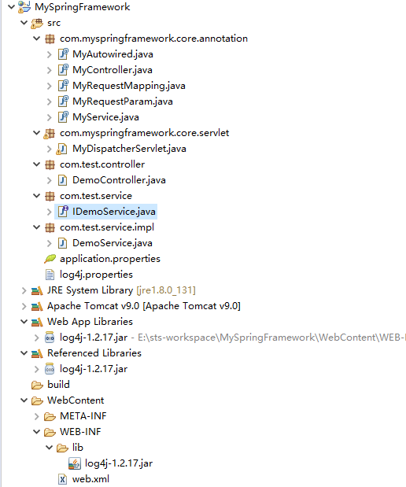
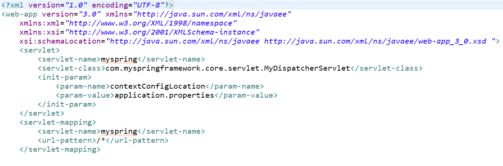
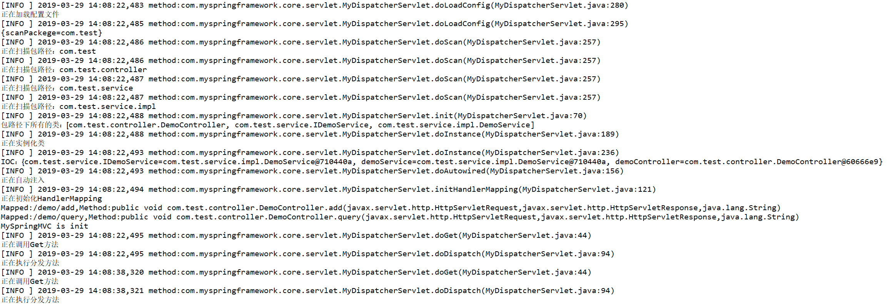

# 手写SpringMVC
   ## 概述：
   本项目是为了探究SpringMVC底层原理，在学习之余自己实现了一个乞丐版SpringMVC。
   ## 功能实现：
   1.项目紧依赖于log4j日志包 
   2.实现了RequestMapping、Controller、Service、Autowired注解。 
   3.在配置文件中配置扫描包路径。 
   4.实现了url到method的映射。 
   5.对不存在页面的404处理，页面异常的500处理 
   ## 功能展示：
   ### 这是项目结构：
   

   ### web.xml：
   

   ### 访问http://localhost/MySpringFramework/demo/query?name=123：
   

   ### 后台日志输出：
   

 
